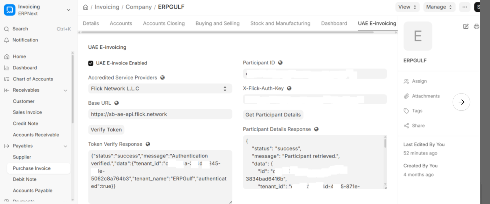
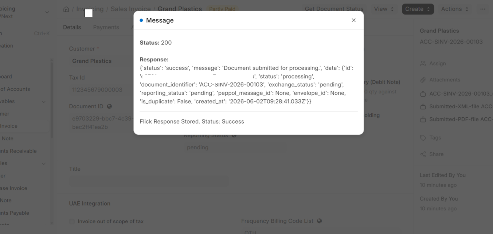
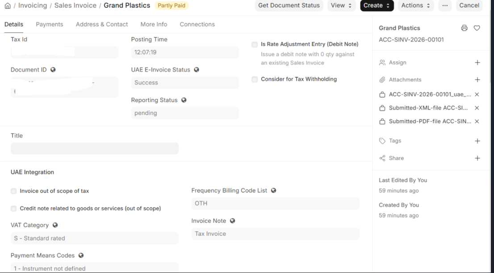
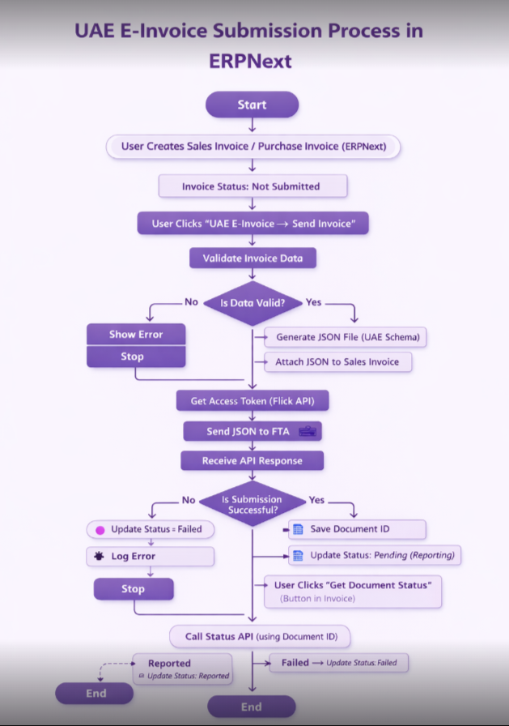
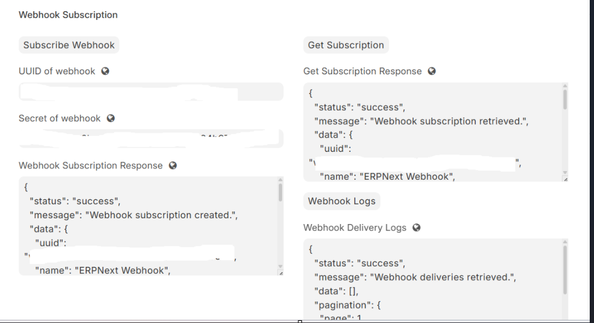
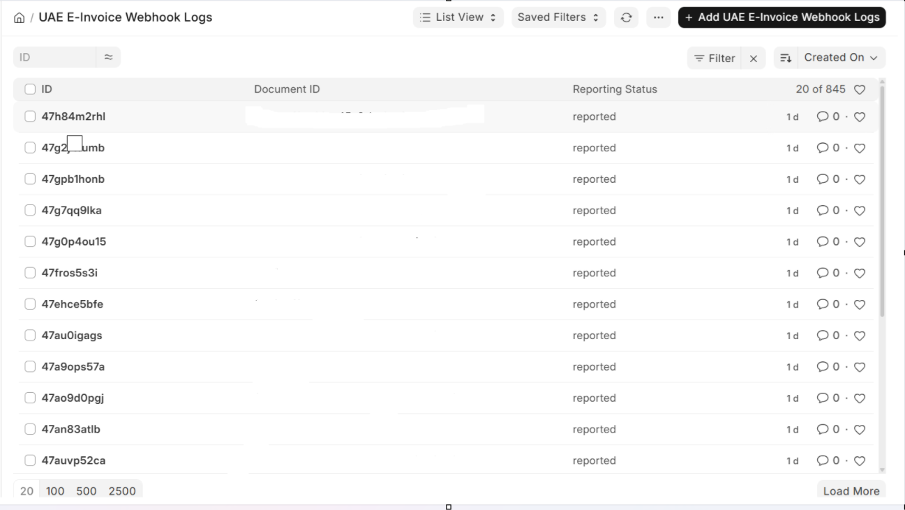

## UAE E-Invoicing Integration for ERPNext

A Frappe / ERPNext application for generating UAE E-Invoicing-ready invoice data, aligned with the upcoming UAE Federal Tax Authority (FTA) e-invoicing framework and UBL 2.1 standards.

This app is designed to help ERPNext users prepare structured invoice payloads, validate UAE VAT-related requirements, and support future API-based invoice clearance and reporting workflows.

#### Overview

The UAE E-Invoicing Integration app provides a configurable foundation for UAE-compliant e-invoicing inside ERPNext.

### It focuses on:

• Generating UAE-compliant invoice data
• Preparing structured JSON payloads for future XML / UBL 2.1 mapping
• Validating VAT, TRN, HS Code, SAC Code, and invoice rules
• Supporting Sales Invoices, Credit Notes, and self-billed documents
• Preparing ERPNext invoices for future FTA clearance and reporting workflows

> Note
>
>The integration is designed with a flexible ASP (Accredited Service Provider) architecture. Any UAE-approved ASP provider can be configured and integrated with this app based on customer requirements and future UAE FTA compliance specifications.
>
>Currently, Flick is available as the initial test and reference implementation for API connectivity and workflow validation.
>
> UAE e-invoicing is currently being rolled out in phases. This implementation is designed to be future-ready, configurable, and aligned with published UAE FTA and PEPPOL-style standards.
>
> At the current stage, the structured invoice JSON generation layer is implemented. FTA submission and full clearance workflow will be added in future phases.

### Features
• Sales Invoice and Credit Note support
• VAT category and tax breakdown handling
• HS Code validation for goods
• SAC Code validation for services
• Invoice Transaction Type Code support
• Payment Means Code support
• Legal Entity and Registration Identifier handling
• Customer and Supplier identification blocks
• Structured JSON generation
• UBL 2.1-compatible mapping structure
• OAuth2 authentication preparation
• API configuration fields
• Participant details fetch support
• Webhook-ready design for real-time invoice status updates
• Designed for ERPNext v16+

### Supported Document Types
# Sales / Accounts Receivable

| Code | Document Type |
| --- | --- |
| 380 | Commercial Invoice |
| 480 | Out of Scope Invoice |
| 381 | Credit Note - Taxable |
| 81 | Credit Note - Out of Scope |

# Purchase / Accounts Payable

| Code | Document Type |
| --- | --- |
| 389 | Self-Billed Invoice |
| 361 | Self-Billed Credit Note |

### Validation Highlights

The app includes validation rules to ensure invoice data is structured correctly before generation.

## Key validations include:

• Quantity must be greater than zero
• Mandatory tax category must be present
• Credit Notes must have a valid reference invoice
• Legal identifiers must be configured before submission
• VAT / TRN details must be available where required
• HS Code is required for goods
• SAC Code is required for services
• Decimal precision is handled using ROUNDHALFUP
• Invoice transaction type must be valid
• Payment means code must be valid

## Installation

Get the app from your repository:
bench get-app uaeerpgulf https://github.com/your-org/uaeerpgulf.git

Install the app on your site:
bench --site yoursite.local install-app uaeerpgulf

Run migrations:
bench --site yoursite.local migrate

Restart bench:
bench restart

## Configuration
Enable UAE E-Invoicing

Go to:

Company → UAE E-Invoicing

Enable:

UAE E-Invoice Enabled

Make sure the company has the correct legal and tax details configured.

## API Setup

Configure the API connection details.

Required fields:

• Base URL
• Participant ID
• X-Flick-Auth-Key

These details are used for connecting with the external e-invoicing API service.

## Authentication

The app is designed to support OAuth2-based authentication.

### Authentication flow:

Verify token
Generate OAuth2 access token
Store token securely
Reuse token until expiry
Regenerate token when expired

### Fetch Participant Details

The participant details flow retrieves business registration information such as:

• VAT / TRN
• Business legal name
• Registration details
• Participant information
• Address and identification details

This helps ensure the company is properly registered and ready for invoice submission workflows.

## Invoice Flow

The expected UAE e-invoicing flow is:

User creates a Sales Invoice in ERPNext
System validates UAE E-Invoicing configuration
System validates invoice data
Invoice payload is generated
Authentication is performed using OAuth2
Invoice is sent to the configured API provider
API provider forwards invoice data to the FTA
Response is received and stored in ERPNext

## flowchart TD
    A[Create Sales Invoice] --> B[Validate Configuration]
    B --> C[Validate Invoice Data]
    C --> D[Generate Invoice Payload]
    D --> E[OAuth2 Authentication]
    E --> F[Send to API Provider]
    F --> G[Forward to FTA]
    G --> H[Store Response in ERPNext]
`

## Webhooks

The app is designed to listen for real-time invoice status updates using webhooks.

Supported webhook events include:

• Invoice Submitted
• Invoice Validated
• Invoice Accepted
• Invoice Rejected
• Invoice Delivered

Webhook responses can be used to update invoice status inside ERPNext.

## Output Formats

Currently supported output:

• Structured Invoice JSON

Planned output:

• UBL 2.1-compatible XML
• FTA-ready invoice submission payload
• API clearance response mapping

> Current Status
>
> Only the structured JSON generation layer is currently implemented. FTA submission and full clearance workflows are not yet completed and will be added in future phases.

## Tech Stack
• ERPNext
• Frappe Framework
• Python
• REST APIs
• OAuth2 Authentication
• Webhooks
• JSON payload generation
• UBL 2.1-compatible data structure

## App Structure

Typical app structure:

`text
uaeerpgulf/
├── uaeerpgulf/
│   ├── hooks.py
│   ├── modules.txt
│   ├── patches.txt
│   └── uaeerpgulf/
│       ├── doctype/
│       ├── api/
│       ├── utils/
│       └── validations/
├── README.md
├── pyproject.toml
└── license.txt
`

## Key Modules

The app may include modules for:

• UAE E-Invoicing Settings
• Invoice JSON generation
• VAT validation
• HS / SAC code validation
• Customer and supplier mapping
• Legal identifier handling
• API authentication
• Participant detail fetch
• Webhook handling
• API response storage

## Important Notes

Before using the app, ensure that:

• Company VAT / TRN details are correct
• Customer VAT / TRN details are maintained where applicable
• Item HS Codes are configured for goods
• SAC Codes are configured for services
• Tax templates are correctly mapped
• API credentials are kept secure
• Invoice data follows the required structured format
• Credit Notes are linked to their original invoices

## Benefits

Using this app can help businesses:

• Improve UAE VAT compliance readiness
• Reduce manual invoice preparation work
• Standardize invoice data
• Improve accuracy and transparency
• Prepare for future UAE FTA e-invoicing requirements
• Maintain structured invoice records inside ERPNext
• Support faster invoice processing workflows

## Planned enhancements include:

• Full UBL 2.1 XML generation
• FTA clearance submission
• API response handling
• Invoice status tracking
• Advanced webhook processing
• Debit Note support
• Purchase invoice self-billing enhancements
• PEPPOL-compatible document exchange
• Additional validation rules based on final UAE FTA specifications

## References
• UAE Federal Tax Authority
• UBL 2.1 Specification
• PEPPOL BIS Billing 3.0

## Compatibility

| Component | Version |
| --- | --- |
| Frappe Framework | v16+ |
| ERPNext | v16+ |
| Python | As supported by Frappe v16 |
| Database | MariaDB / PostgreSQL as supported by Frappe |

## License

This project is licensed under the terms specified in the license.txt file.

## Maintainer

Developed and maintained by ERPGulf.

For implementation, customization, or support, please contact the project maintainer.

### Contact us for Support

Email: support@erpgulf.com

Author: Farook K — https://medium.com/nothing-big